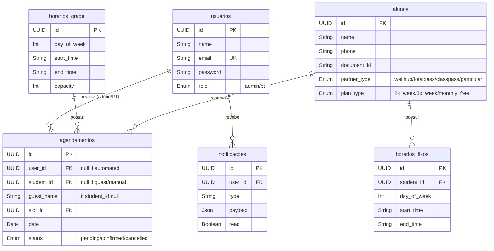

# Arquitetura do Age Treino - Studio Personal

## 1. Visão Geral
O **Age Treino** é um sistema de agendamento de horários focado em studios de personal trainer e academias. O sistema permite que administradores criem grades de horários com limite de vagas e que alunos agendem ou cancelem sua presença nas aulas. O sistema também suporta que o administrador agende manualmente (mesmo para alunos não cadastrados).

## 2. Tecnologias Utilizadas
- **Linguagem:** TypeScript / Node.js
- **Framework Web:** Express.js
- **Banco de Dados:** PostgreSQL
- **ORM:** Prisma
- **Autenticação:** JWT armazenado em cookies HttpOnly
- **Frontend:** HTML, CSS puro, e JavaScript (Vanilla), renderizados como arquivos estáticos com APIs REST.

## 3. Estrutura de Pastas e Responsabilidades

```
/
├── prisma/               # Schema do banco de dados (Prisma) e migrations
├── public/               # Arquivos estáticos do frontend (HTML, CSS, JS)
│   ├── css/              # Estilizações (main.css)
│   ├── js/               # Scripts client-side divididos por funcionalidade (admin, student)
│   ├── admin/            # Telas específicas para o administrador
│   ├── student/          # Telas específicas para o aluno
│   └── index.html        # Landing page e tela de login
├── src/
│   ├── config/           # Configurações globais (banco de dados, variáveis de ambiente)
│   ├── middleware/       # Middlewares do Express (Auth, Error Handling, Rate Limiting)
│   ├── modules/          # Funcionalidades do sistema separadas por domínio
│   │   ├── users/        # Controle de usuários (registro, login, perfil)
│   │   ├── schedules/    # Controle da grade horária base
│   │   ├── appointments/ # Controle de agendamentos reais
│   │   └── notifications/# Sistema de notificações para admins
│   ├── utils/            # Funções utilitárias (geração de tokens, formatação de datas)
│   ├── app.ts            # Configuração principal do Express
│   └── server.ts         # Ponto de entrada (Bootstrapping do servidor HTTP)
└── docs/                 # Documentação técnica e de arquitetura
```

## 4. Fluxo de Autenticação e Autorização
1. O sistema é restrito e não possui cadastro público. Apenas usuários previamente autorizados (Admin/Proprietário e Personal Trainers) possuem acesso.
2. O usuário autorizado envia email e senha na tela de login.
3. O servidor valida as credenciais contra o hash Bcrypt armazenado.
4. Se válido, um token JWT é gerado e assinado com `JWT_SECRET`.
5. O token é inserido num cookie seguro HTTP-only e retornado.
6. Em cada requisição protegida, o middleware `auth.ts` extrai o token do cookie, valida a assinatura e anexa o usuário ao `req.user`.
7. Middlewares de nível superior (`adminOnly`) podem então verificar se a `role` atende ao requisito.

## 5. Modelo de Dados e Relacionamentos



## 6. Controle de Concorrência (Prevenção de Overbooking)
O controle de vagas nos agendamentos é uma região crítica do sistema.
Quando múltiplos usuários tentam agendar a última vaga para o mesmo horário simultaneamente, ocorre o risco de *overbooking*.

O sistema resolve isso usando **Bloqueio de Registros Concorrentes (Pessimistic Locking)** com o Prisma Transaction e SQL Raw (`FOR UPDATE`):
1. Uma transação no banco de dados é aberta.
2. É feito um `SELECT ... FOR UPDATE` nas linhas existentes de `agendamentos` para o slot e data especificados.
3. Se o limite da capacidade não foi atingido, a transação realiza o `INSERT` do novo agendamento.
4. A transação finaliza, soltando o lock.

## 7. Módulo de Alunos e Automação de Agenda
- **Cadastro Restrito:** O administrador (ou proprietário) gerencia o cadastro de alunos através do painel. A interface pública de registro não existe mais.
- **Vínculo de Horários Fixos:** O administrador pode vincular um aluno a horários fixos na semana (ex: Seg e Qua, 09:00).
- **Recálculo Automático:** Baseado nos horários fixos (`horarios_fixos`), o sistema automatiza as reservas e recalcula a capacidade global da agenda, bloqueando vagas automaticamente e garantindo a validação de conflitos.
- **Inscrição Avulsa/Manual:** Visitantes ou agendamentos esporádicos podem ser realizados manualmente pelo admin, preenchendo o nome como "visitante" e deduzindo as vagas pontualmente.

## 8. Deployment e Produção
1. Certifique-se de configurar um servidor PostgreSQL.
2. Execute as migrations: `npm run db:migrate:prod`.
3. Preencha os dados do banco com a conta de admin (opicional): `npm run db:seed`.
4. Compile o TypeScript para JS: `npm run build`.
5. Execute a aplicação (ex: com PM2 ou Docker): `NODE_ENV=production pm2 start dist/server.js`.
6. Use um proxy reverso (Nginx) para servir a aplicação na porta 80/443 e lidar com SSL.
